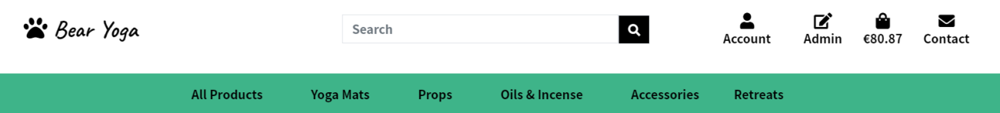
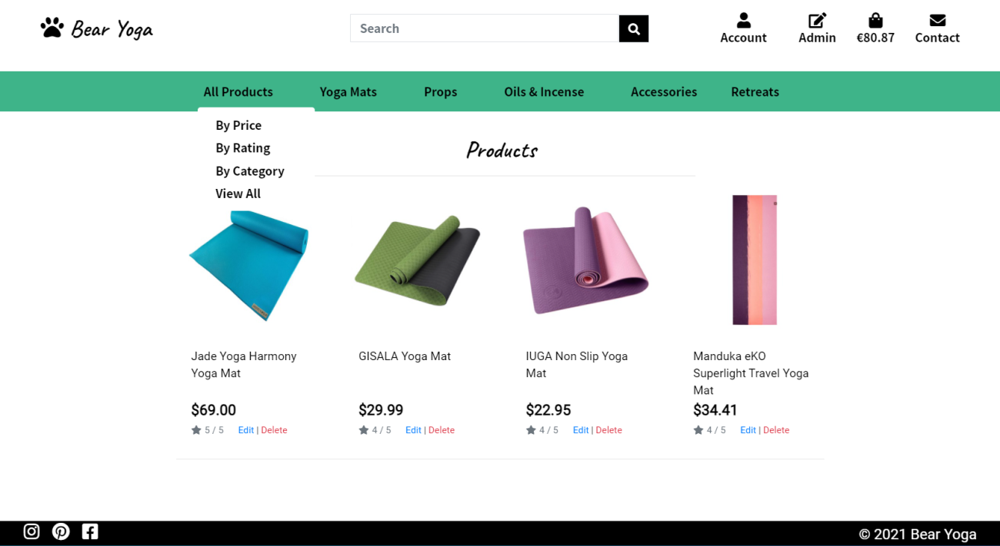
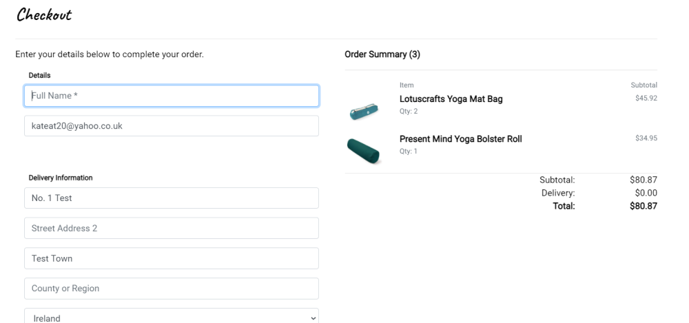

# Bear Yoga

 
 

 

Bear Yoga is an ecommerce website featuring yoga products and information about yoga retreats.
 
 

[Visit Bear Yoga](https://bear-yoga.herokuapp.com/ "Bear Yoga")

 

 

# Project Outline

## UX
 

### Strategy
My goal for this project was to create a simple site that is easy to navigate and that users would want to visit again. The target audience for this site is people who are interested in yoga. Although the main focus of the website is to sell products and promote yoga retreats, it could be expanded to include a community element like a member forum where users could share tips and recommendations. 
 

**Website visitors** can browse through all of the products and make purchases without having to register for an account. 
 

**Registered users** have the additional benefits of an account where their delivery information, order history and saved items are stored for them to access at any time, as well as access to information about yoga retreats run by Bear Yoga. 
 

**Superusers (site owners)** have the option to add, view, update and delete (CRUD) products along with the features of a standard account so site owners can quickly make updates to their product offerings and view the content displayed to their registered users.   

### Who is this website for?
* People who want to purchase yoga products
* People who'd like to find out about yoga retreats 
* A business owner who wants to promote their business and sell products online

### User Stories
**As a site visitor, I want to:**
* View a list of products so that I can select items I want to purchase.
* View individual product details so that I can easily see the price, description and product rating.
* Easily view the total cost of the items in my shopping bag so that I can keep track of my spending.
* Easily register for an account so that I can save my details and view my purchase history
* Sort the list of products so that I can quickly identify the cheapest or most expensive items.
* Sort the list of products so that I can quickly identify products with the highest ratings.
* Search for an item using a keyword so I can find relevant products.
* Sort by category so that I can view all items in a specific category.
* Adjust the quantity of items I am ordering so that I can add more than one of each item to my shopping bag at a time, or adjust the quantity if I change my mind.
* See some form of feedback on screen when I take an action so that I can be sure I have completed the action I intended to.
* Easily contact the shop owner so that I can ask for more information about products and retreats, or notify them of issues with my order.
 

**As a registered user, I want to:**
* Easily sign in and sign out of the site so that I can access my account information quickly.
* Easily recover my password so that I can access my account if I have forgotten my password.
* View my personal profile so that I can view and update or delete my details.
* View my order history so that I can see what products I have ordered in the past if I want to order again.
* Save products to my profile so that I can easily find them if I decide to purchase them at a later time.
* View a list of upcoming yoga retreats so that I can decide if I will attend a retreat.
* Save my payment information so that I can checkout quickly the next time I place an order.
 

**As a site owner or shop administrator, I want to:**
* Have special permissions so that I can add, view, edit and delete (CRUD) products and retreats on the site.
* Easily access an admin menu so that I can quickly add products and retreats to the site.
 

## Login Credentials and Stripe Payment Details
**Login Details** 
Website visitors may browse and purchase products on the site without registering while egistered users have the option to save products to buy at a later date, save delivery and payment information, and view information about upcoming retreats. 
To register for the site, users will need to provide a verified email address but this has been set to 'optional' for the purposes of this project.  
Super user login details have been provided to Code Institute on project submission.   
**Test Card Details** 
The following test card details can be used to submit test Stripe payments on the site:

**Card Number -** 4242 4242 4242 4242 
**CVC -** Any 3 digit number 
**Expiration Date -** Any date in the future 
**Phone Number, Address and Email Address -** These can all be fictional  

## Design
### Surface Level Design

### Defensive Design

## Website Layout 
### Wireframes
 

## Website Features

### Existing Features

**Navbars and navigation**  
There are two navbars displayed on the site - one main navbar and one specific to product categories and retreats. The navigation panel allows the user to move quickly to specific pages on the site. The main navbar shrinks when viewed on smaller devices and the category navbar is moved to a dropdown menu at the top-left of the screen to simplify the interface. The options displayed depend on the access level the user has - a superuser will see all menu options while a non-logged in user will see only the options available to them.
  

**Product Views, Sorting and Search** 
* View Products - Users can scroll through the product list on the main screen. 
* Product Sorting - The category navbar can be used to sort by price, rating and category. Each category has a set of sub-categories to help the user to quickly find the item they're looking for.
* Product Search - The search bar at the top of the screen can be used to search for a specific product or products relating to a particular keyword. 

  

**Retreats**  
***Logged-in users only***
* The main retreats page has a similar layout to the Products screen but doesn't include category sorting or ratings.
* Users can view retreats but cannot add them to their shopping bag - they are for informational purposes only at the moment and the user would need to contact Bear Yoga for more information. 
 

**Contact** 
* Users can access the Contact page via the navbar and complete the form to send a message to the site administrators.
 

**Footer** 
The website footer contains a copyright note and links to social media platforms to promote the business. This could be extended to include information such as opening hours (if there is a physical shop), additional contact information, affiliate links, policies and a newsletter sign-up link.
 

**Superuser Admin Features** 
* Admin menu - Superusers will see an Admin dropdown menu with options to add a new product or retreat.
* Edit/Delete function - Superusers will see a edit and delete options on all product and retreat entries.
 

**Profile**  
***Logged-in users only***
* Delivery Address - Users can update their information here.
* Order History - Users can view their order history and confirmations here. 
 

**Product Detail View** 
In addition to viewing the product details, users can:
* Add to Bag - Add the item to their shopping bag.
* Adjust Quantity - Adjust the quantity of items.
* Save for Later - Logged in users can add the item to their 'Saved Items' so they can find them easily later.
  

  

**Shopping Bag** 
Users can review their shopping bag and update quantities or remove items before moving to the Checkout screen.
 

**Checkout** 
* Delivery and Payment Information - Users can fill in their details here and opt to save them to their profile if they wish.
* Order Summary - Summary of items in the order, delivery fee and total cost.
* Order Confirmation - Once the user has submitted their details and the payment is successful, an order confirmation screen is displayed.
  

  

### Features Left to Implement
**Retreat Booking System** - A booking system that allows users to book and pay for upcoming yoga retreats. Users who have opted in on their profile could be notified when a new event has been added, and submit reviews of past events.
 

**Admin Order Dashboard** - A dashboard where superusers can easily track and update orders. Customer messages could also be managed in this dashboard.
 

**Personalized Recommendations** - A recommended product section featuring products the user is likely to be interested in based on past purchases. This could also be based on a set of category or product preferences the user could specify in their profile.
 

## Information Architecture & Structure

### Database
I used sqlite3 as a database for development and moved to Heroku's PostgreSQL for deployment.  

### Data Models

**Checkout App** 
Name | KEY (Database) | Field Type | Validation 
------------ | ------------- | ------------- | -------------
Order Number | order_number | CharField | max_length=32, null=False, editable=False
User | user_profile | ForeignKey | UserProfile, on_delete=models.SET_NULL, null=True, blank=True, related_name='orders'
Full Name | full_name | CharField | max_length=50, null=False, blank=False
Email Address | email | EmailField | max_length=254, null=False, blank=False
Phone Number | phone_number | CharField | max_length=20, null=False, blank=False
Country | country | CountryField  | blank_label='Country *', null=False, blank=False
Postcode | postcode | CharField | max_length=20, null=True, blank=True
Town or City | town_or_city | CharField | max_length=40, null=False, blank=False
Street Address 1 | street_address1 | CharField | max_length=80, null=False, blank=False
Street Address 2| street_address2 | CharField | max_length=80, null=False, blank=False
County or Region | county | CharField | max_length=80, null=False, blank=False
Date | date | DateTimeField| auto_now_add=True
Delivery Fee | delivery_cost | DecimalField | max_digits=6, decimal_places=2, null=False, default=0
Subtotal | order_total | DecimalField | max_digits=10, decimal_places=2, null=False, default=0
Total | grand_total | DecimalField | max_digits=10, decimal_places=2, null=False, default=0
Shopping Bag| original_bag | TextField | null=False, blank=False, default=''
Stripe PID | stripe_pid | CharField | max_length=254, null=False, blank=False, default=''
 

**Contact App** 
Name | KEY (Database) | Field Type | Validation 
------------ | ------------- | ------------- | -------------
Name | name | CharField | max_length=254 
Email | email | EmailField | max_length=254, null=True, blank=False 
Message | message | TextField |
 

**Product App** 
 

***Categories***
Name | KEY (Database) | Field Type | Validation 
------------ | ------------- | ------------- | -------------
Name | name | CharField | max_length=254
Friendly Name | friendly_name | CharField | max_length=254, null=True, blank=True 
 

***Products***
Name | KEY (Database) | Field Type | Validation 
------------ | ------------- | ------------- | -------------
Category | category | ForeignKey | 'Category', null=True, blank=True, on_delete=models.SET_NULL 
SKU | sku | CharField | max_length=254, null=True, blank=True 
Name | name | CharField | max_length=254
Description | description | TextField | 
Price | price  | DecimalField | max_digits=6, decimal_places=2
Rating | rating | IntegerFiel | null=True, blank=True
Image URL | image_url | URLField | max_length=1024, null=True, blank=True 
Image | image | ImageField | null=True, blank=True
 

**Profile App** 
Name | KEY (Database) | Field Type | Validation 
------------ | ------------- | ------------- | -------------
User | user | OneToOneField | User, on_delete=models.CASCADE 
Phone Number | default_phone_number | CharField | max_length=20, null=True, blank=True
Street Address 1 | default_street_address1 | CharField | max_length=80, null=True, blank=True
Street Address 2| default_street_address2 | CharField | max_length=80, null=True, blank=True
Town or City | default_town_or_city | CharField | max_length=40, null=True, blank=True
County or Region | default_county | CharField | max_length=80, null=True, blank=True
Country | default_country | CountryField  | blank_label='Country', null=True, blank=True
Postcode | default_postcode | CharField | max_length=20, null=True, blank=True
 

**Retreats App** 
Name | KEY (Database) | Field Type | Validation 
------------ | ------------- | ------------- | -------------
Name| name | CharField | max_length=200
Date | date | CharField | max_length=200 
Duration | duration| CharField | max_length=200 
Description| description | TextField | null=False, blank=False, default=''
Price | price | DecimalField | max_digits=10, decimal_places=2, null=False, default=0 
Location| location| CharField | max_length=200
Image URL | image_url | URLField | max_length=1024, null=True, blank=True 
Image | image | ImageField | null=True, blank=True
 

## Technologies Used
 
The following technologies were used to build this project:

**HTML, CSS, JavaScript and Python** - Programming languages used.

**Gitpod IDE** - IDE to build this project.

**Django** - Python framework for rapid development and design.

**Bootstrap** - For website structure elements.

**Stripe** - Payment platform to validate and accept payments.

**Google Fonts** - To style project fonts.

**Font Awesome** - To present navigation icons.

**Django Crispy Forms** - To style django forms.

**AWS S3** - To store static and media files.

**PIP** - To install required tools.

**GitHub** - To store project repository.

**Heroku** - Project deployment.

**Postgres** - Project database.

**Balsamiq** - To create project wireframes.

## Testing
The testing process and results for this project can be found in the [testing.md file](https://github.com/coderkatew/bear-yoga/blob/master/testing.md).
 

## Deployment
### Local Deployment
To run this project locally on your computer, you'll need:

* GitPod, or another online IDE
* A Stripe account 
* An AWS account
 

And you'll need to install:

* Python3
* PIP
* Git
 

**Instructions**
1. Clone the repository using the command git clone https://github.com/coderkatew/bear-yoga or, save a copy of the GitHub repository located at https://github.com/coderkatew/bear-yoga by clicking the green **'Code'** button in the repository menu and selecting **'Download ZIP'** to extract the zip file to your chosen folder.
2. In the terminal, change the directory (cd) to the correct location of the file.
3. Set up the environment variables:
    * Create an `env.py` file in the root directory and add it to the `.gitignore` file.
    * At the beginning of the file, type **import os** to set the environment variables in the operating system.
4. In the terminal:
    * Install the project requirements using this command  `pip3 install -r requirements.txt`
    * Migrate the models to create a database using `python3 manage.py makemigrations` and `python3 manage.py migrate`
    * Load the data fixtures (categories, products, retreats) into the database using:
    `python3 manage.py loaddata <fixture_name>`
    * Create a superuser for the site admin using `python3 manage.py createsuperuser`
5. Once those steps have been completed, you can run the application with:
    `python3 manage.py runserver`
  

To access the **site admin dashboard**, add `/admin` the end of the site's URL link and log in with the superuser credentials created in step 4 above.

### Deploying to Heroku
To deploy the project to Heroku, you can follow these steps:

1. Create a requirements.txt file (this is also required for local deployment, step 4 above).
2. Create a Procfile using the command echo web: `python manage.py > Procfile`, and add this command:
`web: gunicorn bear_yoga.wsgi:application`
3. Make sure the env.py has been added to the `.gitignore` file. All installations required for successful deployment have been installed in the project and are listed in the requirements.txt file.
4. Create an app in Heroku named 'bear-yoga'.
5. Go to 'Reveal Config Vars' in settings in Heroku and add the following environmental variables:
 

    KEY |	VALUE
    ------------ | ------------- | 
    DATABASE_URL | `your postgres database url`
    SECRET_KEY | `your secret key` 
    STRIPE_PUBLIC_KEY | `your stripe public key`
    STRIPE_SECRET_KEY | `your stripe secret key`
    STRIPE_WH_SECRET | `your stripe webhook key`
    USE_AWS	| `True`
    AWS_ACCESS_KEY_ID |`your aws access key`
    AWS_SECRET_ACCESS_KEY | `your aws secret access key`

6. Migrate the models to create a database using `python3 manage.py makemigrations` and `python3 manage.py migrate`
7. Load the data fixtures (categories, products, retreats) into the database using:
    `python3 manage.py loaddata <fixture_name>`
8. Create a superuser for the site admin using `python3 manage.py createsuperuser`
6. Log in to Heroku through the terminal with the command `heroku login -i`.
7. Once you are logged in, use the command `git push heroku master` to push the project to Heroku.
8. Click 'Open App' at the top of the Heroku dashboard and the project will open in a new tab.

 

## Credits and Acknowledgements
### Content and Media

**Product Images and Details** - All product information (text and images) is from [Amazon](https://amazon.co.uk).
  

**Retreat Images and Details** - All retreat images included in the project were downloaded from [Unsplash](https://unsplash.com/) or [Wikimedia Commons](https://commons.wikimedia.org/wiki/Main_Page). Retreat descriptions were paraphrased from [this article](https://www.mindbodygreen.com/articles/the-11-major-types-of-yoga-explained-simply).
  
All content on the site is for educational purposes only.
  

### Acknowledgements
I learned the key concepts of HTML, CSS, Python, Javascript and Django from the Code Institute course materials. I read further material on sites like [Django Project](https://www.djangoproject.com/start/overview/) and watched tutorials to improve my knowledge of Django and Heroku.
 
I used resources like Stack Overflow and W3Schools as well as the Code Institute Slack channels for help with troubleshooting smaller issues during the project. Thanks to Code Institute tutors and my mentor, Guido, for support and guidance during my studies.
 